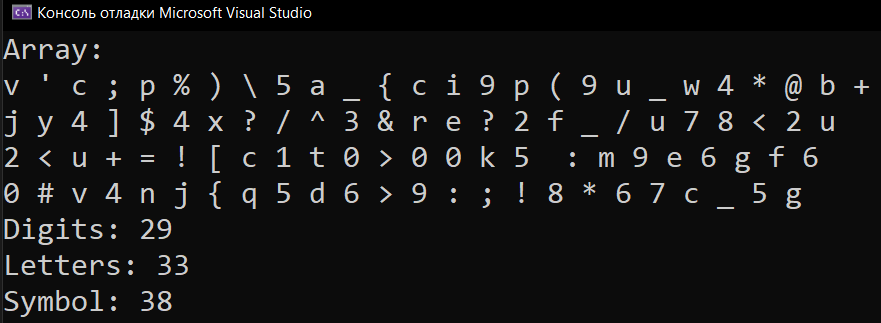

# Homework_15_Arrays
Д/з: Arrays

<a href="https://gist.github.com/SlavikArt/ec0c7d30ed8d53a80e9cab3e6138d9d5">Gist - страница со всеми кодами проектов</a>

* [Task_1](Task_1)
* [Task_2](Task_2)
* [Task_3](Task_3)
* [Task_4](Task_4)
* [Task_5](Task_5)
* [Task_6](Task_6)
* [Task_7](Task_7)
* [Task_8](Task_8)
* [Task_9](Task_9)

    <h2>Task 1</h2>
    

    
    <h2>Task 2</h2>
    

    
    <h2>Task 3</h2>
    

    
    <h2>Task 4</h2>
    

    
    <h2>Task 5</h2>
    

    
    <h2>Task 6</h2>
    

    
    <h2>Task 7</h2>
    

    
    <h2>Task 8</h2>
    

    
    <h2>Task 9</h2>
    

    

